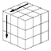
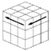
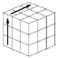
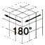
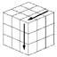
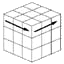
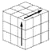
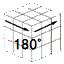

# Solve-method
New solving method of 3x3 cube for senior class 
<a href="https://noriofujii.github.io/Solve-method/lukewarm.html">Page of explanation(Japanese)</a>
(CTRL+click) 
All goals are accomplished by using only X-perm. 

X-perm (Left)  LUL’ULU2L’　　  Xp-a 
       (Right) R’U’RU’R’U’2R  Xp-b

　　
→ 
→ 
→ 
→ 
→ 
→ 
 
　　
→ 
→ 
→ 
→ 
→ 
→ 

